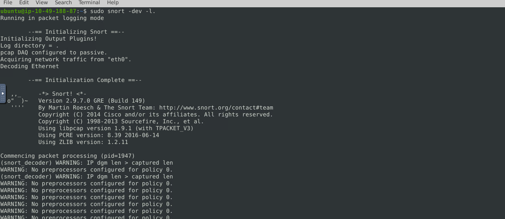
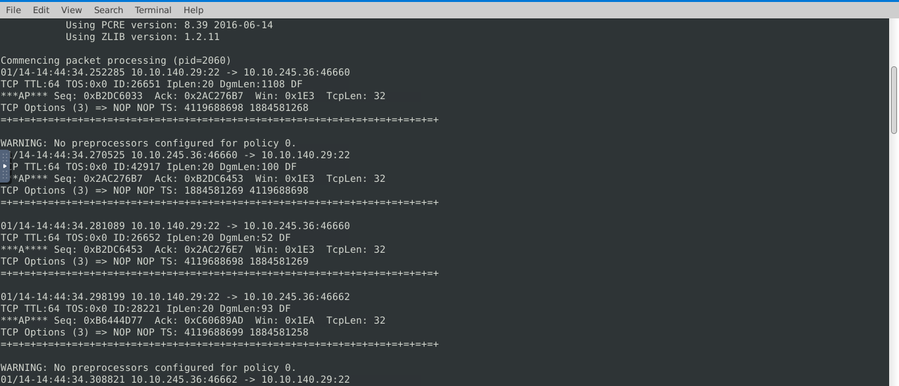
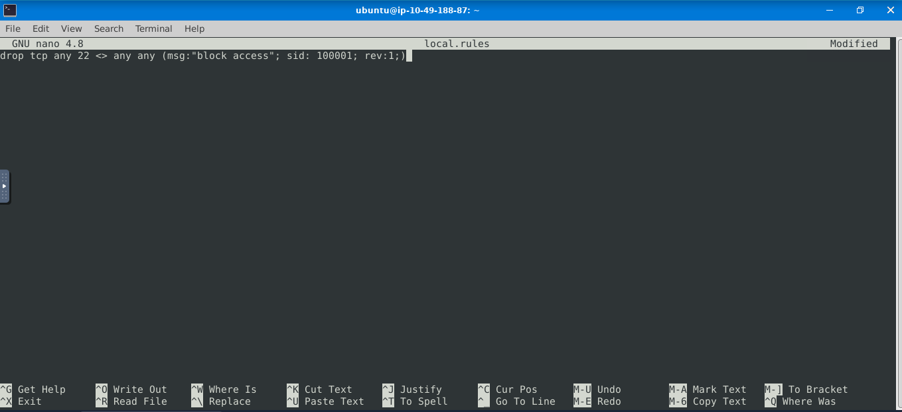
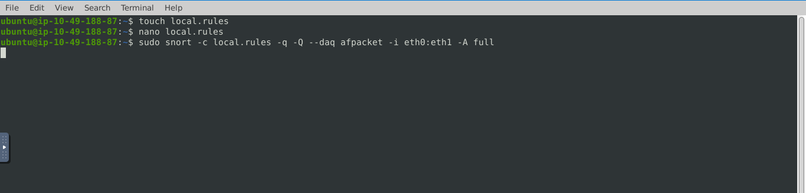

# Snort — Intrusion Detection & Prevention

**Analyst:** Andy Dela Quarshie Wright  
**Role:** SOC Level 1 Analyst  
**Tool:** Snort 2.9.7.0  
**Environment:** TryHackMe — Ubuntu (ip-10-49-188-87)  

---

## Overview

Hands-on Snort lab covering three core use cases — packet sniffing, packet logging, and writing and deploying custom IDS/IPS rules. Demonstrates the ability to configure Snort as a network-based intrusion detection and prevention system, write detection rules, and apply them to live network traffic.

---

## Skills Demonstrated

- Snort sniffer mode — live packet capture and display
- Snort packet logging mode — capturing traffic to disk
- Writing custom Snort rules — drop, alert, msg, sid, rev
- Deploying rules in IPS mode using afpacket DAQ
- Understanding Snort rule syntax and structure
- Network traffic analysis from Snort output

---

## Task 1 — Sniffer Mode

**Objective:** Run Snort in sniffer mode to capture and display live network traffic.

**Command:**
```bash
sudo snort -dev -l .
```

**Flags:**
- `-d` — display application layer data
- `-e` — display link layer headers
- `-v` — verbose mode
- `-l .` — log to current directory

**Output:** Snort initialised on eth0 in passive mode, capturing Ethernet traffic. Packet processing started with PID 1947.



---

## Task 2 — Packet Logging

**Objective:** Capture live TCP traffic and review packet details in Snort output.

**Traffic captured between:**
- 10.10.140.29:22 (SSH server)
- 10.10.245.36:46660 (client)

**Key packet details observed:**
```
01/14-14:44:34.252285 10.10.140.29:22 -> 10.10.245.36:46660
TCP TTL:64 TOS:0x0 ID:26651 IpLen:20 DgmLen:1108 DF
***AP*** Seq: 0xB2DC6033 Ack: 0x2AC276B7 Win: 0x1E3 TcpLen: 32
```

Bidirectional TCP traffic on port 22 — consistent with an active SSH session. Packet flags (AP = ACK + PSH) confirm data transfer in progress.



---

## Task 3 — Write Custom Snort Rule

**Objective:** Write a rule to block all TCP traffic on port 22 (SSH).

**Rule file created:**
```bash
touch local.rules
nano local.rules
```

**Rule written:**
```
drop tcp any 22 <> any any (msg:"block access"; sid: 100001; rev:1;)
```

**Rule breakdown:**
| Field | Value | Meaning |
|-------|-------|---------|
| Action | drop | Block and log the packet |
| Protocol | tcp | TCP traffic only |
| Source | any 22 | Any IP on port 22 |
| Direction | <> | Bidirectional |
| Destination | any any | Any IP any port |
| msg | "block access" | Alert message in logs |
| sid | 100001 | Unique rule ID |
| rev | 1 | Rule revision number |



---

## Task 4 — Deploy Rule in IPS Mode

**Objective:** Apply the custom rule to live traffic using Snort in inline IPS mode.

**Command:**
```bash
sudo snort -c local.rules -q -Q --daq afpacket -i eth0:eth1 -A full
```

**Flags:**
- `-c local.rules` — use custom rules file
- `-q` — quiet mode (suppress banner)
- `-Q` — inline IPS mode
- `--daq afpacket` — use afpacket DAQ for inline operation
- `-i eth0:eth1` — bridge interfaces eth0 and eth1
- `-A full` — full alert output



---

## Snort Rule Reference

See [rules/local.rules](rules/local.rules) for all rules written in this lab.

---

## MITRE ATT&CK Relevance

| Technique | ID | How Snort Detects It |
|-----------|-----|---------------------|
| Exploitation of Remote Services | T1210 | Custom rules on suspicious ports |
| Network Scanning | T1046 | Alert rules on high connection volumes |
| Command and Control | T1071 | Rules matching C2 traffic patterns |
| Lateral Movement via SSH | T1021.004 | Drop rule on port 22 |

---

## Certifications

- CompTIA Security+
- TryHackMe SOC Level 1
- Google Cybersecurity Professional Certificate
